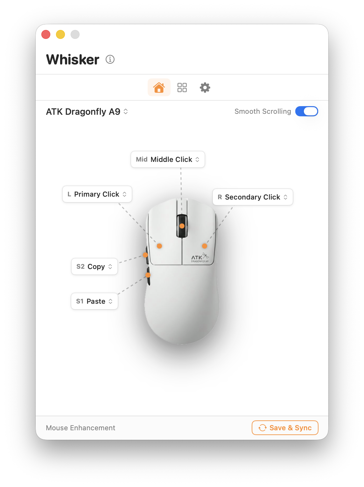
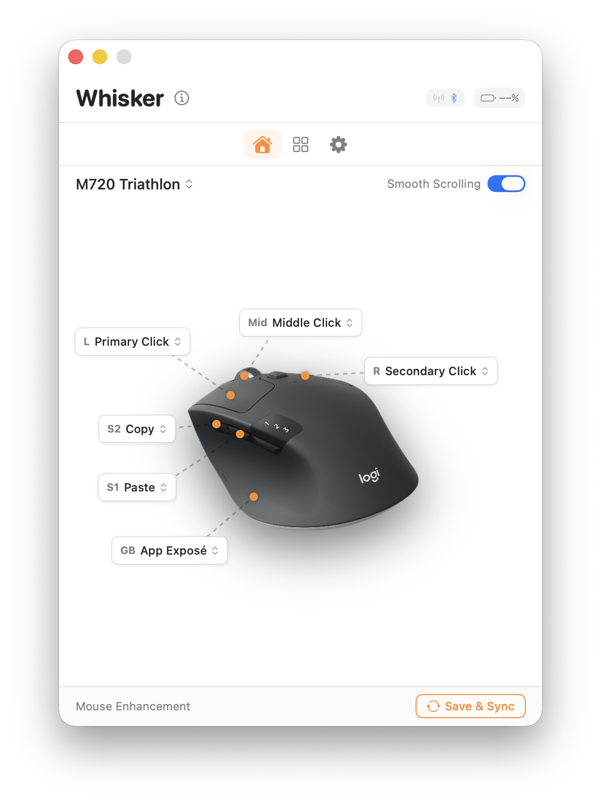
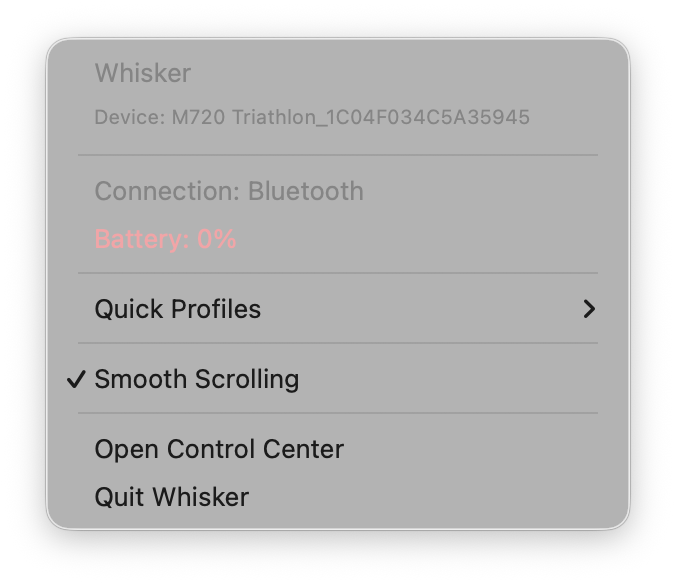

# 🐭 Whisker

**Whisker** 是一款专为 macOS 设计的外设增强工具。它轻量、纯净，旨在为使用各类鼠标或键盘但厌倦了臃肿官方驱动的用户提供核心的增强功能。

  

## ✨ 特性

- **电量监测**: 实时显示鼠标百分比电量。
- **配置方案**: 支持多套按键映射与增强配置（Gaming / Work 等）。
- **轻量化设计**: 仅保留核心功能，极低的系统资源占用。
- **连接状态**: 智能识别蓝牙、USB 及 Receiver 连接。
- **自动同步**: 实时保存并同步您的鼠标配置。
- **M720 手势键**: 支持自定义拇指托下方的 GB 手势键，并显示接管与按键检测状态。

## 📸 预览

### 🐭 多品牌无缝适配

| ATK Dragonfly A9 | Logitech G Pro Wireless | Logitech M720 Triathlon |
| :---: | :---: | :---: |
|  |  |  |

### ⚙️ 核心功能与状态栏

| 状态栏快捷功能 | 配置管理 | 系统设置 |
| :---: | :---: | :---: |
|  |  |  |

## 🚀 快速开始

1. **下载**: 从 [Releases](https://github.com/CalvinQin/Whisker/releases) 页面下载最新的 `Whisker.v1.1.6.app.zip`。
2. **安装**: 将 `Whisker.app` 拖入您的 `Applications` 文件夹。
3. **权限**: 首次运行请授予“辅助功能”权限；使用 M720 的 GB 手势键时，还需授予“输入监控”权限。

> [!NOTE]
> 如果覆盖升级后 Whisker 再次显示权限提示，请在“系统设置 > 隐私与安全性”中重新启用 Whisker 的“辅助功能”和“输入监控”，然后重启 Whisker。

## 🛠 支持型号

目前的初始版本重点支持以下型号：

- **Logitech M720 Triathlon**
- **Logitech G Pro Wireless**
- **Logitech MX 系列** (部分支持)
- **ATK Dragonfly A9**

> [!TIP]
> **我们需要您的力量！**
> Whisker 的远景目标是适配更多品牌和型号的鼠标及键盘系统。如果您拥有其他型号的外设并愿意协助测试，请在 [Issues](https://github.com/CalvinQin/Whisker/issues) 中提交您的设备信息。

## 🤝 贡献与想法

我们欢迎任何形式的贡献：

- **新功能想法**: 想要平滑滚动？手势支持？欢迎提出想法！
- **代码贡献**: 发现 Bug 或想优化性能？请随时提交 PR。
- **设备适配**: 提交您的 HID 报告描述符以帮助支持更多型号。

## 📜 许可证

本项目采用 [MIT License](LICENSE) 开源。

---

*Made with ❤️ for the Mac Peripheral Community.*
